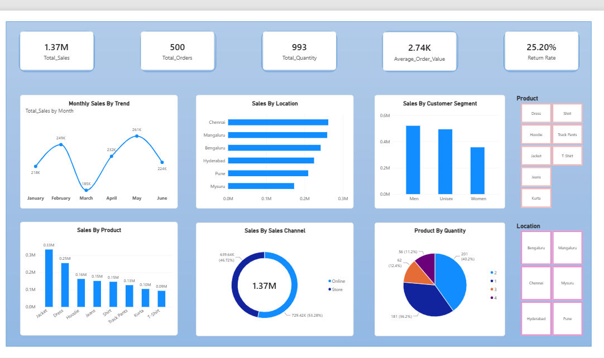
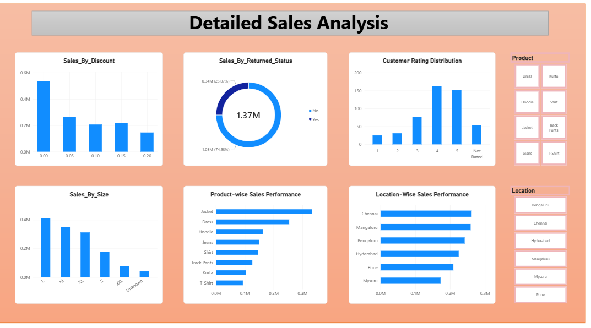

# Retail Clothes Sales Analysis – Power BI

## Project Overview

This project analyzes retail clothing sales data using Microsoft Excel and Power BI. The dashboard provides insights into sales performance, products, categories, locations, sales channels, discounts, returns, and customer ratings.

## Objective

The main objective of this project is to analyze retail sales data and identify useful business insights through data cleaning, analysis, and interactive visualization.

## Tools & Technologies

- Microsoft Excel
- Power BI
- Power Query

## Dataset

The dataset contains retail sales information including:

- Order ID
- Order Date
- Customer ID
- Product
- Category
- Size
- Location
- Sales Channel
- Quantity
- Unit Price
- Discount
- Payment Method
- Returned
- Customer Rating

## Data Cleaning

The following data preparation steps were performed:

- Removed duplicate records
- Handled missing values
- Corrected invalid quantity values
- Checked data types
- Prepared the cleaned dataset for analysis

## Dashboard Analysis

The Power BI dashboard analyzes:

- Overall sales performance
- Sales by product and category
- Sales by location
- Online vs Store sales
- Return analysis
- Discount analysis
- Customer rating distribution

## Key Insights

- Jackets generated the highest sales among the categories in the dataset.
- Chennai recorded the highest sales among the analyzed locations.
- Online and Store sales were compared to understand sales-channel performance.
- Return patterns and customer ratings were analyzed through interactive visuals.

## Skills Demonstrated

- Data Cleaning
- Data Analysis
- Data Visualization
- Microsoft Excel
- Power BI
- Power Query
- Dashboard Development
- Business Insights

## Project Outcome

This project helped me develop practical skills in transforming raw sales data into an interactive Power BI dashboard and communicating data-driven insights clearly.

## Dashboard Preview

### Page 1 – Sales Overview

### Page 2 – Detailed Analysis

